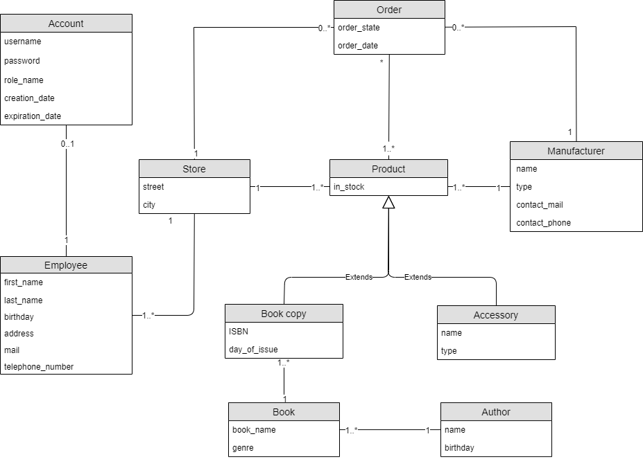
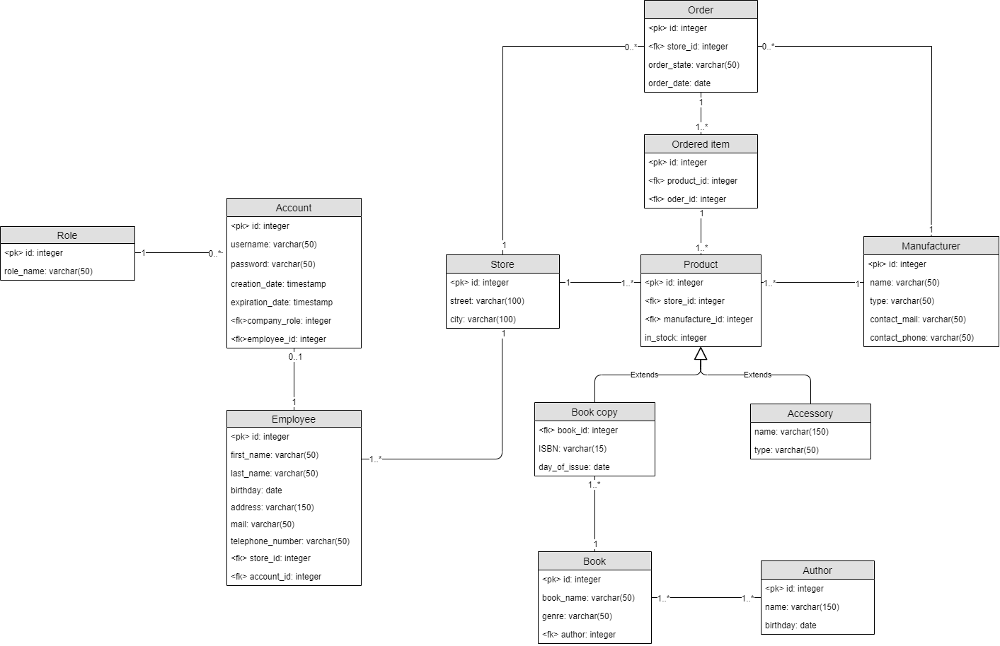

# Informačný systém pre kníhkupectvá
Tento projekt by mal slúžiť ako informačný systém pre kníhkupectvá. Bude pomocou neho možné manažovať zamestnancov, informácie 
o nich a pobočkách na ktorých pracujú, naskladnených knihách a objednávkach nových, nenaskladnených kníh.

## Implementácia projektu

Java + Spring Boot + Vaadin + PostgreSQL

## Logický model

## Fyzický model

## SQL Dump
https://drive.google.com/drive/u/1/folders/13-i9qajceLx2uGuJpxQykanNXdWjGqzk?fbclid=IwAR1pSRNdcLzU_tp8SzUtLQNWJREl2_Nas4gu8IpCmaDaBvAfxDTP6RxlARU
(treba ísť cez STUBA GSuite)

## Spustenie aplikácie

Importujte projekt do IDE ako Maven projekt.

Spustite databázu a spustite skript na vytvorenie tabuliek (schema/db_schema.sql)

Spustite aplikáciu pomovou `mvn spring-boot:run` alebo spustením triedy `Application` priamo z IDE.

Otvorte http://localhost:8080/ v prehliadači.

Základní užívatelia (nehľadiac na to, či boli generovaní alebo neboli generovaní iní užívatelia):

| Používateľské meno | Heslo | Rola |
| :--- | :--- | :--- |
| admin | admin | Manažér|
| user | user | Zamestnanec|

## Štruktúra

| Directory | Description |
| :--- | :--- |
| `schema/` | Schéma pre databázu aplikácie |
| `frontend/` | Zdrojový adresár pre klienta (v tomto projekte nie moc používaný)|
| &nbsp;&nbsp;&nbsp;&nbsp;`index.html` | HTML template |
| &nbsp;&nbsp;&nbsp;&nbsp;`index.ts` | Vstupný frontendový bod |
| &nbsp;&nbsp;&nbsp;&nbsp;`views/` | UI |
| &nbsp;&nbsp;&nbsp;&nbsp;`styles/` | Štýly |
| `src/main/java/<groupId>/` | Zdrojový adresár pre server |
| &nbsp;&nbsp;&nbsp;&nbsp;`dao/` | Objekty využívané na prístup do databázy (repozitáre a dao) |
| &nbsp;&nbsp;&nbsp;&nbsp;`model/` | Entity |
| &nbsp;&nbsp;&nbsp;&nbsp;`service/` | Prostredníci medzi databázou a frontendom |
| &nbsp;&nbsp;&nbsp;&nbsp;`view/` | Frontend |
| &nbsp;&nbsp;&nbsp;&nbsp;`Application.java` | Vstupný bod servera |
| &nbsp;&nbsp;&nbsp;&nbsp;`AppShell.java` | Konfigurácia application-shell |
| &nbsp;&nbsp;&nbsp;&nbsp;`SecurityConfig.java` | Konfigurácia pre spring security |
| &nbsp;&nbsp;&nbsp;&nbsp;`DataGenerator.java` | Generátor dát, ktorý sa spustí v prípade, že dáta ešte neboli generované |

## Zdroje

- [Vaadin Flow](https://vaadin.com/flow) documentation
- [Using Vaadin and Spring](https://vaadin.com/docs/v14/flow/spring/tutorial-spring-basic.html) article
- [Quick Start Guide](https://vaadin.com/docs/v15/flow/typescript/quick-start-guide.html for Vaadin applications.

